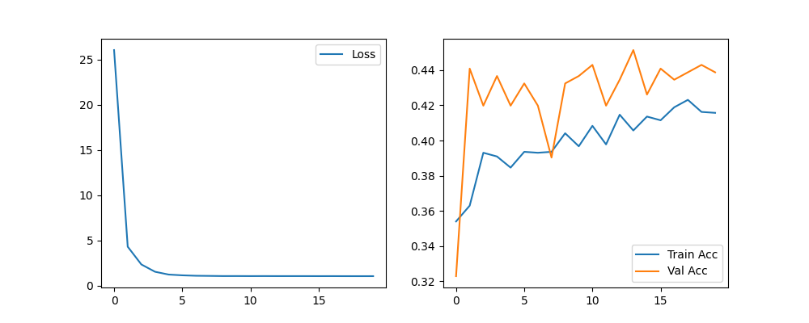
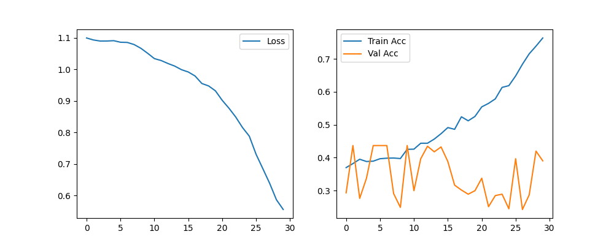

# Neural Network Training and Optimization

This repository contains the implementation of a baseline neural network and an optimized ResNet architecture to compare their performance on a given task.

## Files

- **`nn_wrh.py`**: Baseline neural network implementation.
- **`nn_optimize.py`**: ResNet architecture implementation with optimizations.
- **`training_plot.png`**: Training and validation performance curves for the baseline model.
- **`optimized_training_curves.png`**: Training and validation performance curves for the ResNet model.

## Description

1. The **baseline model** (`nn_wrh.py`) was implemented using a simple neural network architecture. The model shows modest performance levels suitable for basic tasks.
2. The **optimized ResNet model** (`nn_optimize.py`) demonstrates improved performance in both accuracy and training/validation loss. Key improvements include the use of residual connections and better regularization.

## Visualizations

### Baseline Model Training

The above plot illustrates the training and validation curves for the baseline neural network.

---

### Optimized ResNet Model Training

The above plot illustrates the training and validation curves for the ResNet model.
